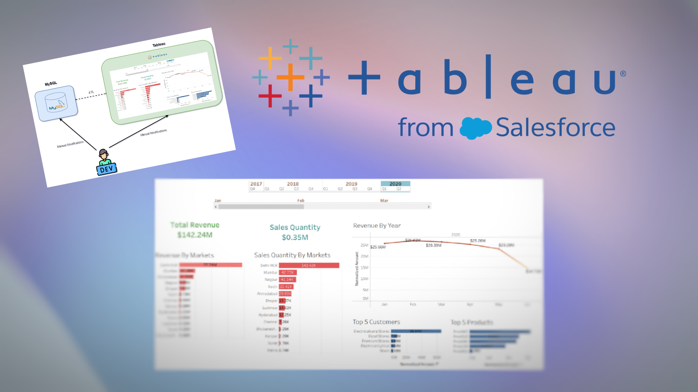

# Data Visualization Project - Tableau

> Leveraging Tableau and MySQL for powerful business intelligence insights

## Table of Contents
- [Data Visualization Project - Tableau](#data-visualization-project---tableau)
  - [Table of Contents](#table-of-contents)
  - [Overview](#overview)
    - [Demo](#demo)
  - [Architecture](#architecture)
  - [Dashboard](#dashboard)
    - [Components](#components)
    - [Visual](#visual)

## Overview

This project, developed during August 2024, focuses on creating interactive business intelligence dashboards using Tableau and MySQL. The goal was to transform raw data into actionable insights through effective data visualization and analysis.

### Demo

*Features:*

*MySQL Queries:*

## Architecture

## Dashboard

### Components

1. **Date Selection**
   - Dynamic year/month filtering
   - Real-time data updates
   - Historical trend analysis

2. **Revenue By Markets**
   - Sorted bar chart visualization
   - Market-wise revenue breakdown
   - Interactive filtering capabilities

3. **Sales Quantity By Markets**
   - Quantity-based analysis
   - Price-quantity correlation insights
   - Market performance metrics

4. **Top 5 Customers**
   - High-value customer identification
   - Investment pattern analysis
   - Customer segmentation

5. **Top 5 Products**
   - Revenue-based product ranking
   - Performance tracking
   - Product trend analysis

### Visual

