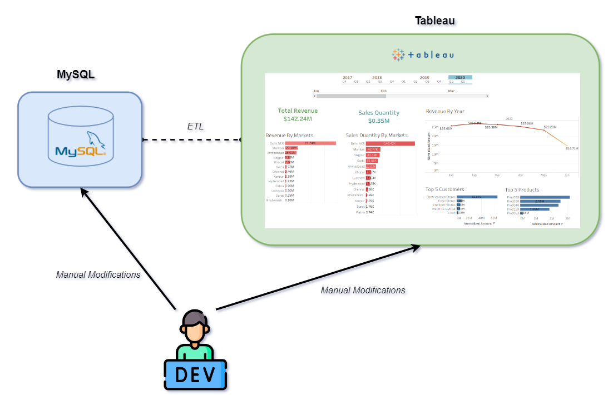
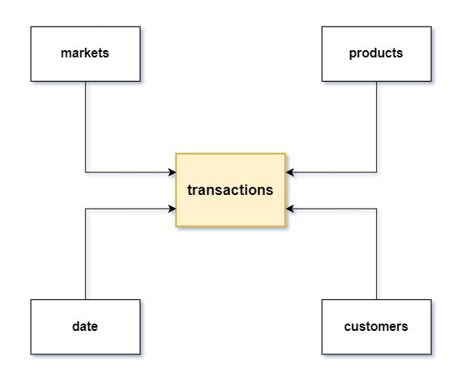
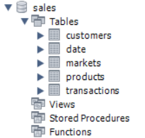
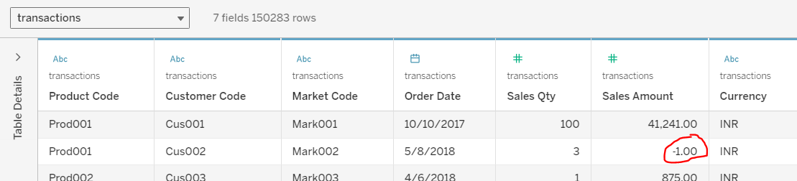
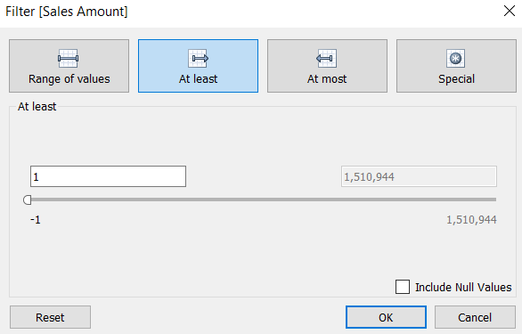
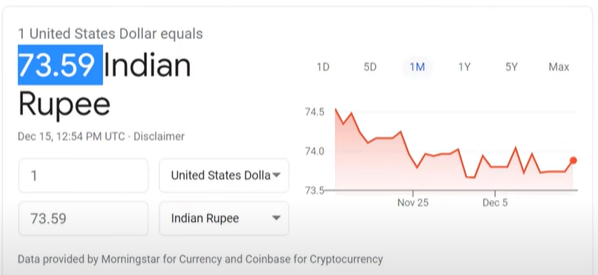
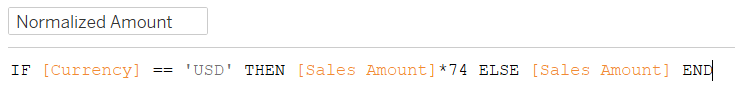
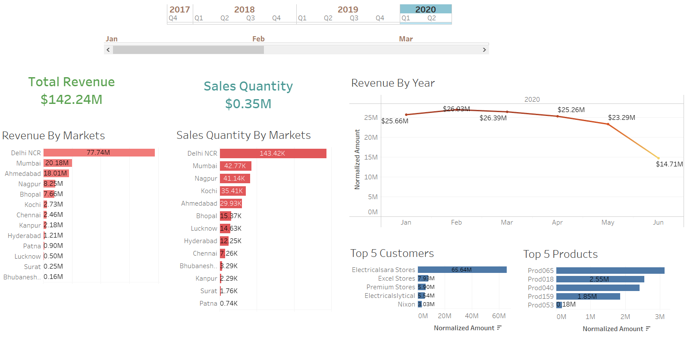

# Data Visualization Project - Tableau

I worked on this project during August 2024 to gain knowledge about data visualization and business intelligence. For this project, I used `MYSQL Workbench` to manage the data and `Tableau` to visualize it. I used MySQL and connected the database to Tableau using a datamodel to define relations between the tables.

## Project - Delivery

A dashboard that provides latest sales insights to support data-driven decision making. It is interactable and allows you to exclude the categories that don't concern your current problem you're trying to solve.

*Architecture:*

As shown in the demo video above, the Tableau dashboard is divided in 5 main sections:

**Date Selection:** The upper-most section that allows you to specify the month or/and year of the data

**Revenue By Markets:** The left-most bar chart in sorted order, displays the total revenue of each market

**Sales Quantity By Markets:** The right-most red bar chart that displays the sales quantity. This is really helpful, as the devleloper now has the ability to compare the differences between the two bar charts to see how the pricing of products affects the sales quantity

**Top 5 Customers:** Displays the 5 customers that invest the most money in their consumption of the company's products

**Top 5 Products:** Displays the 5 highest revenue generating products

## Problem Statement

The overall purpose with this project fulfills in a corporate setting is to automate the process of illustrating data from an established database. However, for the final product to be satisfactory, I followed a procedure of eliciting requirements that I learned from two of my previous courses [Requirements & User Experience](https://gitlab.com/jex-projects/mrjex/-/tree/main/projects/1.%20courses/year-1/4.%20Requirements%20&%20User%20Experience?ref_type=heads) and [Software Development Methodologies](https://gitlab.com/jex-projects/mrjex/-/tree/main/projects/1.%20courses/year-2/4.%20Software%20Development%20Methodologies?ref_type=heads)

### Functional Requirements

1. The product shall be able to separately display filtered options based on year and month

2. The product shall be able to be interactive, such that the visualizations of each market-category can be displayed one at a time

3. The product shall display the top 5 in any financial metric

### Quality Attributes

1. The year/month filtering must be easy for the user to locate. The user shall be able to find the section within 1.5 seconds 8/10 times

2. The request to query a market-category on all charts must always take less than 5.0 seconds to execute

### Stakeholders

- Sales Director

- Marketing Team

- Customer Service Team

- Data & Analytics Team

## Tableua

This was my first time working with this software. Below I've listed the things I learned.

### Star Schema

- A concept commonly used to define relationships between tables in the same database in Tabluea

*Star Schema Template that I followed:*

*Implemented Star Schema:*

### Foreign keys

As opposed to primary keys that are unique identifiers within its table, foreign keys are references in one table to a primary key in another table. I was already familiar with this concept from a [Data Management](https://gitlab.com/jex-projects/mrjex/-/tree/main/projects/1.%20courses/year-1/6.%20Data%20Management?ref_type=heads) course I attended in 2023.

*MYSQL Workbench Tables:*

### Data cleaning

In Data Science, the concept of cleaning data before using it is imperative. When producing or retrieving large dataset, chances are that somewhere in the process something went wrong and resulted in values that are rationally impossible to achieve.

#### Illogical values

As I retrieved the public dataset and inspected it in Tableau, I noticed illogical values on a few instances. The value of a column was -1, which is a logical fallacy. It would imply that a store gives the customers money for consuming their products, instead of the other way around.

I understood that these will contribute to inaccuracy, and removed them

#### Currencies conversion

Another aspect of the SQL database that I used that wasn't consistent was the differing values of the instances' currencies. Thus, I understood that the first step was to select one currency, and that the last step had to involve data cleaning of the dismissed currency. In this context, data cleaning could potentially be either eliminating all related instances, or converting those instances' values with respect to the selected currency's relative exchange rate.

In this case, for the purpose of learning Tableua I wrote a function in the platform with a fixed multiplier value to transition between the currencies. I looked up the rate between USD and INR at the particular day when I was developing this project and noticed that the multiplier was 73.59. Lastly, I simply used an non-decimal approximation (74) in the function.

I decided to go with INR over USD. As I googled the relative exchange rate, I noticed that is was 73.59 at the given date.

I was now faced with two possible approaches:

1. Tableua Function with hardcoded exchange-rate-multiplier

    - Advantage: Easy & Quick implementation. No complexities nor system dependency modifications needed

    - Disadvantage: Although it's somewhat accurate, it's conversion isn't reliable for frugal or meticulous stakeholders

2. Exchange rate Microservice that calls APIs to retrieve the current currency-rates

    - Advantage: Due to the fact that the fluctation of the exchange rates is an ever-changing process, it's a neccessity to work with the currency rates at the given moment to obtain precision in the economical conversions

*Implemented Dashboard:*

### Contextual Filter

I used something called *Contextual Filter* in Tableau to implement top-5 sorting features. The problem this solves is to query only for the top-5 instances on the selected market, rather than querying all instances to top 5.

### ETL

By applying the process of extract, transform, and load (ETL), individual raw datasets can be prepared in a format and structure that is more consumable for analytics purposes, resulting in more meaningful insights.